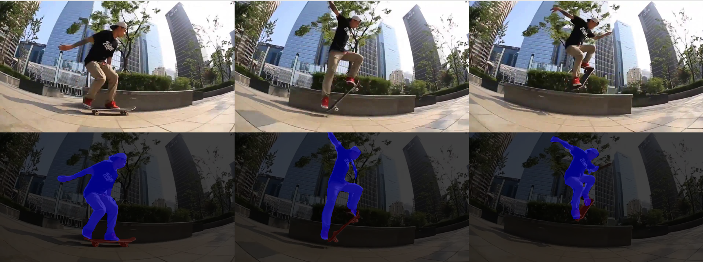

# VisTR_mindspore
- [Description](#description)
- [Model Architecture](#model-architecture)
- [Dataset](#dataset)
- [Environment Requirements](#environment-requirements)
- [Quick Start](#quick-start)
    - [Requirements Installation](#requirements-installation)
    - [Dataset Preparation](#dataset-preparation)
    - [Model Checkpoints](#model-checkpoints)
    - [Running](#running)
- [Examples](#examples)
    - [Training](#training)
    - [Infer Process](#infer-process)
- [Model Description](#model-description)
    - [Performance](#performance)
- [Citation](#citation)

## [Description](#contents)

Video instance segmentation (VIS) is the task that requires simultaneously classifying, segmenting and tracking object instances of interest in video. Recent methods typically develop sophisticated pipelines to tackle this task. Here, we propose a new video instance segmentation framework built upon Transformers, termed VisTR, which views the VIS task as a direct end-to-end parallel sequence decoding/prediction problem. Given a video clip consisting of multiple image frames as input, VisTR outputs the sequence of masks for each instance in the video in order directly. At the core is a new, effective instance sequence matching and segmentation strategy, which supervises and segments instances at the sequence level as a whole. VisTR frames the instance segmentation and tracking in the same perspective of similarity learning, thus considerably simplifying the overall pipeline and is significantly different from existing approaches. Without bells and whistles, VisTR achieves the highest speed among all existing VIS models, and achieves the best result among methods using single model on the YouTube-VIS dataset.

[paper](https://arxiv.org/abs/2011.14503):Wang Y, Xu Z, Wang X, et al.End-to-End Video Instance Segmentation with Transformers.2020.

This repository contains a Mindspore implementation of VisTR based upon original Pytorch implenmentation(<https://github.com/Epiphqny/VisTR>) and the evaluation results are shown in the [Performance](#performance) section.

# [Model Architecture](#contents)

The overall network architecture of FairMOT is shown below:

[Link](https://arxiv.org/abs/2011.14503)

# [Dataset](#contents)

Dataset used: [2019 version of YoutubeVIS](https://youtube-vos.org/dataset/vis/) .

-   2,883 high-resolution YouTube videos, 2,238 training videos, 302 validation videos and 343 test videos
-   A category label set including 40 common objects such as person, animals and vehicles
-   4,883 unique video instances
-   131k high-quality manual annotations

# [Environment Requirements](#contents)

To run the python scripts in the repository, you need to prepare the environment as follow:

- python and deendencies:
    -   python 3.7.5
    -   Cython == 0.29.30
    -   cython-bbox = 0.1.3
    -   decord == 0.6.0
    -   mindspore-gpu == 1.8.1
    -   ml-collections == 0.1.1
    -   matplotlib == 3.5.3
    -   numpy == 1.21.6
    -   Pillow == 9.2.0
    -   PyYAML == 6.0
    -   scikit-learn == 1.0.2
    -   scipy == 1.7.3
    -   pycocotools == 2.0
    -   pytorch == 1.12.1
- For more information, please check the resources below：
    - [MindSpore tutorials](https://www.mindspore.cn/tutorials/en/master/index.html)
    - [MindSpore Python API](https://www.mindspore.cn/docs/en/master/index.html)

# [Quick Start](#contents)

## [Requirements Installation](#contents)

Some packages in `requirements.txt` need Cython package to be installed first.And you also need to install youtubevos coco api, which is mainly used for YouTubeVIS data loading and evaluation. For this reason, you should use the following commands to install dependencies:

```shell
pip install Cython && pip install -r requirements.txt
```
```shell
pip install git+https://github.com/youtubevos/cocoapi.git#"egg=pycocotools&subdirectory=PythonAPI"
```

## [Dataset Preparation](#contents)

VisTR model uses YouTubeVIS as dataset and we call it "ytvos".

After download dataset, then put all training and evaluation data into one directory and then change `"data_root"` to that directory in [data.json](datas/data.json) , like this:
```
"data_root": "/home/publicfile/dataset/tracking",
``` 

## [Model Checkpoints](#contents)
The pretrain model(vistr_r50, vistr_r101) is trained on the youtubevos dataset for 18 epochs. It can be downloaded here: [vistr_r50.ckpt]().

## [Running](#contents)

Please run one of the following command in root directory [vistr_mindspore](./).

```shell
# standalone training on GPU
bash train_standalone.sh [PROJECT_PATH] [DATA_PATH]
```

To infer the model, run the shell script [scripts/run_infer.sh](scripts/run_infer.sh) with the format below:

```shell
bash scripts/infer_standalone.sh [PROJECT_PATH] [DATA_PATH] [MODEL_PATH]
```

If you want to train or evaluate the model in other parameter settings, please refer to [vistr_r50_train.py](src/example/vistr_r50_train.py) or [vistr)r50_infer.py](src/example/vistr_r50_infer.py) to change your input parameters in script.

## [Example](#contents)

### [Training](#contents)

```shell
bash train_standalone.sh /home/vistr /home/publicfile/VOS
```

The tranin log can be viewed in `./train_standalone.log`.

### [infer](#contents)

```shell
bash infer_standalone.sh /home/vistr /home/publicfile/VOS vistr_r50.ckpt
```
The infer log can be viewed in `./eval_result.log`

# [Model Desrcription](#contents)

## [Perfermance](#contents)

### VisTR on YouTube-VIS dataset

#### Perfirmance parameters

| Parameters          | GPU Standalone             |
| ------------------- | ---------------------------|
| Model Version       | VisTR_r50                  |
| Resource            | 1x RTX 3090 24GB           |
| Uploaded Date       | 7/12/2022 (day/month/year)|
| MindSpore Version   | 1.8.1                      |
| Training Dataset    | YouTube-VIS                |
| Evaluation Dataset  | YouTube-VIS                |
| Training Parameters | epoch=18, batch_size=1     |
| Optimizer           | Adam                       |
| Loss Function       | L1Loss,SigmoidFocalLoss,DiceLoss,CrossEntroyLoss          |
| Train Performance   |       mask AP: 35.814%            |


#### BenchMark

|Method          |backbone   | FPS     |     AP|    AP50  |AP75  |AR1   |AR10|
|----------------|-----------|---------|-------|----------|------|------|----|
|DeepSORT        | ResNet-50 |   -     | 26.1  |   42.9   |26.1  |27.8  |31.3|
|FEELVOS         | ResNet-50 |   -     | 26.9  |   42.0   |29.7  |29.9  |33.4|
|OSMN            | ResNet-50 |   -     | 27.5  |   45.1   |29.1  |28.6  |33.1|
|MaskTrack R-CNN | ResNet-50 |   20    | 30.3  |   51.1   |32.6  |31.0  |35.5|
|STEm-Seg        | ResNet-50 |   -     | 30.6  |   50.7   |33.5  |31.6  |37.1|
|STEm-Seg        | ResNet-101|   2.1   | 34.6  |   55.8   |37.9  |34.4  |41.6|
|MaskProp        | ResNet-50 |   -     | 40.0  |    -     |42.9  | -    | -  |
|MaskProp        | ResNet-101|   -     | 42.5  |    -     |45.6  | -    | -  |
|VisTR(Pytorch)  | ResNet-50 |30.0/69.9| 36.2  |   59.8   |36.9  |37.2  |42.4|
|VisTR(Pytorch)  | ResNet-101|27.7/57.7| 40.1  |   64.0   |45.0  |38.3  |44.9|
|VisTR(MindSpore)| ResNet-50 |   -     | 35.8  |   60.8   |37.4  |36.5  |42.1|


#### Segmentation Result



# [Citation](#contents)
```
@inproceedings{wang2020end,
  title={End-to-End Video Instance Segmentation with Transformers},
  author={Wang, Yuqing and Xu, Zhaoliang and Wang, Xinlong and Shen, Chunhua and Cheng, Baoshan and Shen, Hao and Xia, Huaxia},
  booktitle =  {Proc. IEEE Conf. Computer Vision and Pattern Recognition (CVPR)},
  year={2021}
}
```
```BibTeX
@misc{MindSpore Vision 2022,
    title={{MindSpore Vision}:MindSpore Vision Toolbox and Benchmark},
    author={MindSpore Vision Contributors},
    howpublished = {\url{https://gitee.com/mindspore/vision}},
    year={2022}
}
```
